

# UNIVERSIDAD PRIVADA DE TACNA  
## FACULTAD DE INGENIERÍA  
### Escuela Profesional de Ingeniería de Sistemas

**Sistema de Monitoreo y Gestión de Red para Laboratorios UPT (SIMGR-UPT)**

Curso: *Inteligencia de Negocios*  
Docente: *Mag. Patrick Cuadros Quiroga*

**Integrantes:**

- Escobar Rejas, Carlos Andrés (2021070016)
- Apaza Ccalle, Albert Kenyi (2021071075)
- Cutipa Gutierrez, Ricardo (2021069827)
- Churacutipa Blass, Erick (2020067578)
- Huallpa Maron, Jesús Antonio (2021071085)

**Tacna – Perú**  
***2024***

---

# Sistema de Monitoreo y Gestión de Red para Laboratorios UPT (SIMGR-UPT)*

**Documento de Especificación de Requerimientos de Software**

Versión *{1.0}*

---

## CONTROL DE VERSIONES

| Versión | Hecha por | Revisada por | Aprobada por | Fecha      | Motivo           |
| :-----: | --------- | ------------ | ------------ | ---------- | ---------------- |
| 1.0     | RCG       | AAC          | AAC          | 18/11/2024 | Versión Original |
---

# INDICE GENERAL

1. [INTRODUCCION](#INTRODUCCION)  
   - I. Generalidades de la Empresa  
     - 1. Nombre de la Empresa
     - 2. Visión
     - 3. Misión
     - 4. Organigrama
   - II. Visionamiento de la Empresa  
     - 1. Descripción del Problema
     - 2. Objetivos de Negocios
     - 3. Objetivos de Diseño
     - 4. Alcance del proyecto
     - 5. Viabilidad del Sistema
     - 6. Información obtenida del Levantamiento de Información
   - III. Análisis de Procesos  
     - a) Diagrama del Proceso Actual – Diagrama de actividades
     - b) Diagrama del Proceso Propuesto – Diagrama de actividades Inicial
   - IV. Especificación de Requerimientos de Software  
     - a) Cuadro de Requerimientos funcionales
     - b) Cuadro de Requerimientos No funcionales
     - d) Reglas de Negocio
   - V. Fase de Desarrollo  
     - 1. Perfiles de Usuario
     - 2. Modelo Conceptual  
       - a) Diagrama de Paquetes
       - b) Diagrama de Casos de Uso
       - c) Escenarios de Caso de Uso (narrativa)
     - 3. Modelo Lógico  
       - a) Análisis de Objetos
       - b) Diagrama de Actividades con objetos
       - c) Diagrama de Secuencia
       - d) Diagrama de Clases

2. [CONCLUSIONES](#CONCLUSIONES)
3. [RECOMENDACIONES](#RECOMENDACIONES)
4. [BIBLIOGRAFÍA](#BIBLIOGRAFIA)
5. [WEBGRAFÍA](#WEBGRAFIA)

---

## I. Introducción 

El desempeño de la red en los laboratorios de informática de la Universidad Privada de Tacna es un elemento crucial para garantizar la calidad del aprendizaje y la eficiencia operativa de las actividades académicas. Actualmente, los laboratorios enfrentan desafíos significativos relacionados con la falta de monitoreo en tiempo real, lo que dificulta la detección temprana de problemas y limita la capacidad de respuesta ante incidentes que afectan la conectividad.

En este contexto, el desarrollo de un sistema de monitoreo de red se presenta como una solución integral para abordar estas limitaciones. Este sistema no solo permitirá supervisar continuamente el estado de la red en los laboratorios, sino que también facilitará la identificación de cuellos de botella, el análisis de tendencias de uso y la optimización del ancho de banda.

La herramienta propuesta recopilará datos clave sobre el rendimiento de la red, como velocidad de conexión, latencia y consumo de recursos. A través de la ingesta de estos datos en tiempo real, el sistema generará alertas automáticas ante fallos o anomalías, brindando a los administradores información detallada para la toma de decisiones rápidas y fundamentadas.

Este documento de especificación de requerimientos establece una descripción completa del sistema, detallando sus objetivos, alcance, funcionalidades y las necesidades técnicas que debe cumplir. Con esta base, se busca garantizar una implementación exitosa que responda a las expectativas de la institución y beneficie directamente a los estudiantes y docentes.

### I. Generalidades de la Empresa

### 1. Nombre de la Empresa
Universidad Privada de Tacna

### 2. Visión
La visión del proyecto es convertir los laboratorios de informática de la universidad en un modelo de gestión eficiente de redes, mediante el uso de herramientas tecnológicas avanzadas que promuevan un entorno académico conectado, estable y proactivo.

### 3. Misión
La misión del sistema es garantizar un monitoreo efectivo y continuo del rendimiento de la red en los laboratorios, proporcionando a los usuarios un acceso confiable a los recursos tecnológicos y optimizando la infraestructura para responder a las necesidades de aprendizaje.

### 4. Organigrama

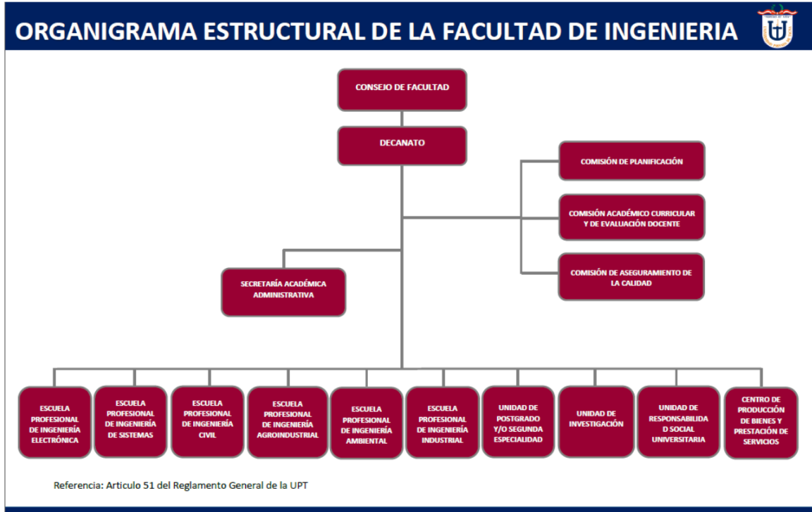

### II. Visionamiento de la Empresa

#### 1. Descripción del Problema

El rendimiento actual de la red en los laboratorios de la UPT enfrenta limitaciones significativas que impactan directamente en la experiencia de los usuarios:

- **Falta de visibilidad y monitoreo proactivo:** No existe un sistema que permita rastrear el estado de la red en tiempo real, lo que dificulta identificar problemas como caídas o picos de consumo antes de que afecten el servicio.

- **Resolución reactiva de incidentes:** La identificación de fallos se produce únicamente después de que los usuarios los reportan, lo que retrasa la respuesta y amplifica el impacto de los problemas.

- **Desperdicio de recursos tecnológicos:** La asignación del ancho de banda no está optimizada, lo que genera ineficiencias en el uso de los recursos disponibles.

- **Dificultades para identificar tendencias de uso:** Sin datos históricos organizados, es complejo analizar patrones que podrían prevenir problemas recurrentes o mejorar el rendimiento de la red.

#### 2. Objetivos de Negocios

- **Optimizar el uso de recursos de red:** Asegurar una distribución eficiente del ancho de banda en los laboratorios, maximizando la capacidad de la red para soportar las actividades académicas sin interrupciones.

- **Detectar problemas de red en tiempo real:** Implementar un sistema que permita identificar rápidamente fallas, cuellos de botella o interrupciones en la conectividad, reduciendo tiempos de inactividad y mejorando la continuidad del servicio.

- **Reducir costos operativos:** Minimizar el gasto innecesario en soporte técnico reactivo o en soluciones temporales mediante un monitoreo continuo que permita actuar de manera preventiva.

- **Mejorar la toma de decisiones:** Proporcionar información detallada y reportes analíticos que ayuden a los administradores a planificar el mantenimiento de la red, realizar ajustes y justificar inversiones futuras en infraestructura tecnológica.

- **Fortalecer la experiencia de los usuarios:** Garantizar que estudiantes y docentes cuenten con una red confiable y de alto rendimiento para sus actividades académicas, mejorando la calidad del aprendizaje y la productividad en los laboratorios.

#### 3. Objetivos de Diseño

- **Ingesta continua de datos:** Diseñar una plataforma que permita la recopilación y procesamiento continuo de datos críticos sobre el rendimiento de la red, como velocidad de conexión y consumo de ancho de banda, asegurando que esta información esté disponible en tiempo real.

- **Interactividad y facilidad de uso:** Crear una interfaz interactiva e intuitiva que facilite la navegación y gestión del sistema por parte de los técnicos responsables, independientemente de su nivel de experiencia técnica.

- **Visualización de datos clara y precisa:** Incorporar gráficos dinámicos, tablas detalladas y reportes personalizados que presenten el estado de la red de forma comprensible y visualmente accesible, destacando métricas como velocidad y consumo.

- **Personalización:** Proveer herramientas que permitan a los usuarios ajustar las visualizaciones según sus necesidades específicas, como intervalos de tiempo definidos o métricas relevantes para sus tareas.

- **Accesibilidad y disponibilidad:** Asegurar que la plataforma funcione de manera óptima en entornos de escritorio y sea accesible desde ubicaciones con conexión a Internet, permitiendo el monitoreo y la gestión de la red en cualquier momento.

#### 4. Alcance del proyecto

**Inclusiones:**

- **Recopilación y análisis de datos en tiempo real:** El sistema estará diseñado para recopilar y analizar datos relevantes sobre el rendimiento de la red en tiempo real. Esto incluirá parámetros clave como la velocidad de conexión y los niveles de uso del ancho de banda, proporcionando una visión completa y precisa del estado de la red en cualquier momento.

- **Generación de alertas automáticas:** El sistema contará con capacidades para generar alertas automáticas cuando se detecten anomalías o caídas en el servicio. Esto permitirá a los administradores y técnicos tomar decisiones rápidas y proactivas para resolver problemas antes de que afecten significativamente a los usuarios.

- **Creación de reportes visuales y exportables:** La plataforma incluirá herramientas para la creación de reportes visuales detallados, que incluirán gráficos y tablas sobre el rendimiento de la red, así como informes sobre incidentes. Estos reportes podrán ser exportados en formatos estándar como PDF o Excel, lo que facilitará la documentación y el análisis fuera de la plataforma.

- **Dashboard interactivo:** Se implementará un dashboard interactivo que permitirá a los administradores y técnicos ver en tiempo real el estado de la red y las tendencias históricas del rendimiento. Este dashboard será fácil de navegar y proporcionará una visión clara de los puntos críticos de la red, permitiendo a los responsables tomar decisiones informadas y oportunas.

**Exclusiones:**
- **Administración de dispositivos o usuarios individuales fuera de los laboratorios:** El sistema se enfocará exclusivamente en el monitoreo de la red en los laboratorios de informática, sin incluir la administración de dispositivos o usuarios fuera de este ámbito.

- **Funcionalidades relacionadas con otros aspectos de TI:** El sistema no abordará funcionalidades como la seguridad de la red o la gestión de software, ya que estos aspectos serán gestionados por otros sistemas especializados de la universidad.

#### 5. Viabilidad del Sistema

##### 5.1. Viabilidad Técnica

**Hardware Disponible**

- **Equipos de desarrollo:** Se necesitan equipos capaces de ejecutar las herramientas necesarias para la creación y mantenimiento del sistema de monitoreo. Los requisitos mínimos incluyen:
  - **Procesador:** Intel Core i5 o superior, que garantice un rendimiento eficiente en tareas de desarrollo y pruebas.
  - **Memoria RAM:** Entre 8 y 16 GB DDR4, adecuada para ejecutar múltiples procesos en paralelo.
  - **Almacenamiento:** Un disco SSD de al menos 256 GB para tiempos de respuesta rápidos y estabilidad operativa.
  - **Tarjeta gráfica:** Uso de gráficos integrados en el procesador, suficiente para el desarrollo de aplicaciones estándar.

**Software Disponible**

- **Aplicaciones y Herramientas de Desarrollo:**
  - **AWS (Amazon Web Services):** Proveedor de servicios en la nube utilizado para almacenamiento, análisis y despliegue del sistema.
  - **Terravision:** Integración para la visualización y monitoreo de la red a través de representaciones geoespaciales.
  - **Terraform:** Herramienta de infraestructura como código para la configuración y automatización del entorno de desarrollo en la nube.
  - **Python con HCL2:** Lenguaje usado para procesar configuraciones de Terraform y ejecutar scripts personalizados que gestionen la interacción con AWS y la infraestructura de red.

**Infraestructura de Red**

- **Conectividad estable:** Es esencial contar con una conexión a internet confiable y de alta velocidad en los laboratorios para garantizar la ingesta continua de datos y el funcionamiento del sistema en tiempo real.
- **Equipos de red gestionados:** Dispositivos como switches y routers con capacidades avanzadas que soporten el monitoreo de tráfico y permitan ajustes dinámicos según las necesidades detectadas.

**Automatización y Configuración**

- El uso de Terraform asegura la consistencia en la configuración de entornos de desarrollo, pruebas y producción, reduciendo errores manuales y acelerando los despliegues.
- Scripts desarrollados en Python con HCL2 automatizan la interacción entre los nodos de monitoreo y el servidor central, optimizando la recolección y análisis de datos en tiempo real.

##### 5.2. Viabilidad Económica

El análisis de costos totaliza los recursos necesarios para el desarrollo e implementación del sistema, considerando los siguientes conceptos:

| **Concepto** | **Costo Total (S/.)** |
|--------------|-----------------------|
| **Costos Generales** | 3,222.00 |
| **Costos Operativos durante el Desarrollo** | 500.00 |
| **Costos del Ambiente** | 450.00 |
| **Costos del Personal** | 6,000.00 |
| **Total** | 10,172.00 |

Este presupuesto permite cubrir todos los aspectos esenciales del proyecto, asegurando una relación costo-beneficio favorable y sostenibilidad a largo plazo.

##### 5.3. Viabilidad Operativa

**Factibilidad Operativa**

- **Optimización de Recursos:** La herramienta permitirá maximizar la utilización de los recursos tecnológicos al proporcionar datos detallados sobre el uso de la red en tiempo real. Esto ayudará a la universidad a planificar con mayor precisión el mantenimiento, la actualización o la redistribución de los recursos disponibles.
  
- **Mejora en la Toma de Decisiones:** Con acceso a información precisa sobre el desempeño de la infraestructura tecnológica, los administradores podrán adoptar decisiones informadas y basadas en datos, mejorando tanto la eficiencia operativa como la calidad del servicio ofrecido a estudiantes y docentes.
  
- **Facilidad de Uso e Integración:** Diseñada para ser intuitiva, la herramienta minimizará la curva de aprendizaje del personal técnico y administrativo, además de integrarse sin problemas con los sistemas existentes, reduciendo el impacto en las operaciones cotidianas.

#### 6. Información obtenida del levantamiento de información

Durante el levantamiento de información para el desarrollo del sistema, se identificaron los siguientes aspectos clave:

**Necesidades de los Técnicos de Soporte:**

- Requieren una herramienta centralizada para monitorear el estado de la red en tiempo real, con alertas automáticas que les permitan identificar problemas antes de que afecten a los usuarios.

**Requerimientos de los Administradores:**

- Necesitan reportes claros y personalizados sobre el rendimiento de la red para tomar decisiones informadas y planificar mantenimientos o actualizaciones futuras.

Esta información valida la necesidad del sistema como una solución integral para optimizar el rendimiento y la gestión de la red en los laboratorios de la universidad.

### III. Análisis de Procesos

- Diagrama del Proceso Actual – Diagrama de actividades

  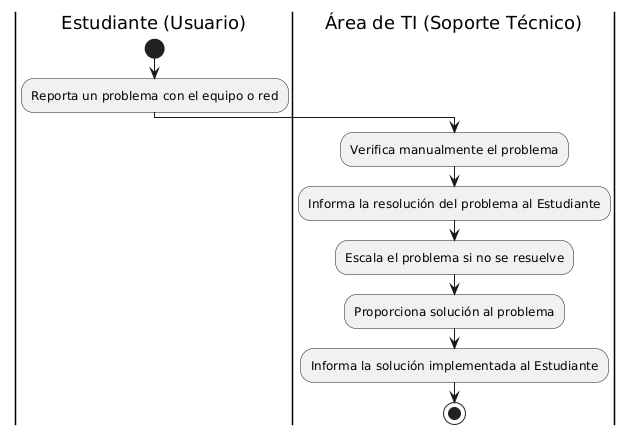
  
- Diagrama del Proceso Propuesto – Diagrama de actividades Inicial

  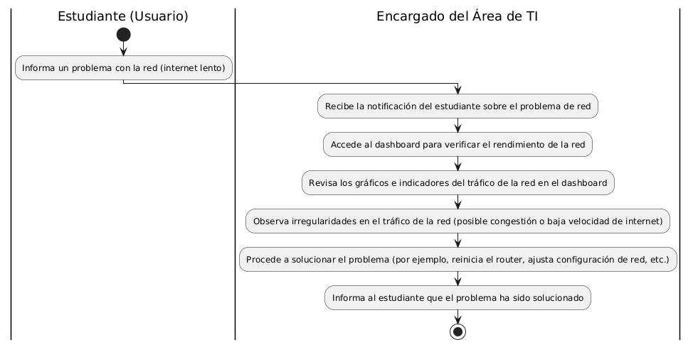

### IV. Especificación de Requerimientos de Software

1. Cuadro de Requerimientos funcionales

|  ID   | Descripción                                                                                           | Prioridad |
| :---: | :---------------------------------------------------------------------------------------------------- | :-------: |
| RF-01 | Monitorear en tiempo real el uso del tráfico de red de los equipos. |   Alta    |
| RF-02 | Generar reportes detallados y personalizables sobre el rendimiento de los equipos y patrones de uso.   |   Alta    |
| RF-03 | Detectar, notificar y registrar anomalías en el rendimiento de los recursos tecnológicos.              |   Alta    |
| RF-04 | Exportar datos en formatos compatibles con Tableau (CSV, Excel) y JSON.                               |   Alta    |
| RF-05 | Almacenar datos históricos para análisis a largo plazo y comparativas de rendimiento.                  |   Alta    |
| RF-06 | Proporcionar un panel de control interactivo para visualizar datos clave en tiempo real.               |   Alta    |
| RF-07 | Permitir la integración con otros sistemas de gestión de la universidad mediante API REST.             |  Media    |

2. Cuadro de Requerimientos No funcionales

|  ID   | Descripción                                                                                   | Prioridad |
| :---: | :-------------------------------------------------------------------------------------------- | :-------: |
| RNF-01 | El sistema debe ser compatible con sistemas operativos Windows y distribuciones de Linux.     |   Alta    |
| RNF-02 | La interfaz debe ser intuitiva y accesible desde navegadores web modernos.                    |   Alta    |
| RNF-03 | Los datos recolectados deben estar protegidos mediante protocolos de seguridad.  |   Alta    |
| RNF-04 | La solución debe ser escalable para nuevos laboratorios sin comprometer el rendimiento.       |   Alta    |
| RNF-05 | El tiempo de respuesta para operaciones críticas debe ser menor a 2 segundos.                 |   Alta    |
| RNF-06 | El almacenamiento debe incluir respaldo automático y procedimientos de recuperación ante fallos. |   Alta    |
| RNF-07 | El consumo de recursos del sistema debe ser mínimo para no afectar el rendimiento de los equipos monitorizados. |  Media    |

3. Reglas de Negocio

|  ID   | Descripción                                                                                                     | Prioridad |
| :---: | :------------------------------------------------------------------------------------------------------------- | :-------: |
| RN-01 | Solo el personal autorizado podrá acceder al sistema y a los datos recolectados mediante credenciales seguras.  |   Alta    |
| RN-02 | Toda la información recolectada debe estar cifrada durante su transmisión y almacenamiento.                     |   Alta    |
| RN-03 | Los reportes de rendimiento deben generarse automáticamente semanalmente, con posibilidad de generarlos bajo demanda. |   Alta    |
| RN-04 | El sistema debe permitir integración con otras plataformas mediante API REST garantizando seguridad de los datos. |   Media   |
| RN-05 | Los datos recolectados deben respaldarse automáticamente diariamente en una ubicación segura.                    |   Alta    |
| RN-06 | Los datos recolectados serán utilizados exclusivamente para la optimización de recursos y mejora del servicio.  |   Alta    |
| RN-07 | El sistema permitirá configurar umbrales personalizados para alertas basadas en parámetros de rendimiento.      |   Media   |
| RN-08 | El sistema debe ser escalable para incluir nuevos laboratorios o cambios en la infraestructura tecnológica.     |   Alta    |
| RN-09 | Los reportes deben incluir recomendaciones para realizar mantenimiento preventivo en equipos que lo requieran.  |   Media   |
| RN-10 | El sistema debe operar con consumo mínimo de recursos (CPU, RAM) para no afectar el rendimiento de los equipos. |   Alta    |
| RN-11 | El sistema debe garantizar una disponibilidad operativa mínima del 95%.                                        |   Alta    |

### V. Fase de Desarrollo

1. Perfiles de Usuario

Estudiante

**Descripción:**
El Estudiante es el usuario que utiliza los recursos de la red en los laboratorios. Si experimenta un problema con la conexión a la red (por ejemplo, lentitud o desconexión), debe informar al encargado del área de TI.

**Responsabilidades:**

Utilizar los recursos de la red para las actividades académicas en los laboratorios de la universidad.
Informar al Encargado del Área de TI cuando detecte problemas en la red, como conexión lenta o caída del servicio.

**Interacciones con el Sistema:**

El estudiante no interactúa directamente con el dashboard.
Informa al encargado de TI sobre los problemas detectados, proporcionando detalles sobre la lentitud de la red o interrupciones en el servicio.

Encargado del Área de TI (Soporte Técnico)

**Descripción:**
El Encargado del Área de TI es responsable de gestionar el monitoreo de la red en los laboratorios, asegurando que el tráfico de la red sea adecuado para las actividades académicas. Este perfil tiene acceso al dashboard para verificar y analizar el tráfico de la red en tiempo real.

**Responsabilidades:**

Recibir informes de problemas de red del Estudiante.
Acceder al dashboard para monitorear el rendimiento y tráfico de la red.
Analizar los gráficos y datos del dashboard para verificar posibles irregularidades en la red (por ejemplo, congestión o lentitud).
Tomar medidas correctivas o preventivas basadas en los datos visualizados en el dashboard.
Informar al estudiante sobre la resolución del problema o el estado de la red.

**Interacciones con el Sistema:**

Accede al dashboard de monitoreo de la red para verificar el estado del tráfico.
Analiza los gráficos y los datos de la red, como el uso del ancho de banda y los tiempos de respuesta.
Realiza acciones para solucionar los problemas de red (por ejemplo, ajustes de configuración, reinicio de equipos, etc.).

2. Modelo Conceptual
   - Diagrama de Paquetes
     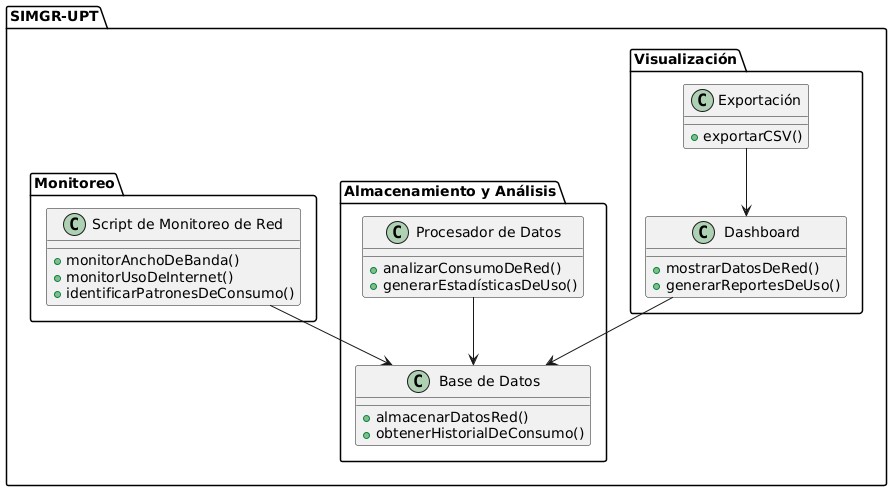
   - Diagrama de Casos de Uso
     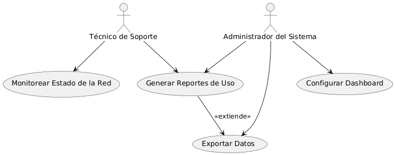
   - Escenarios de Caso de Uso (narrativa)
**Caso de Uso: Monitorear Estado de la Red (CU01)**

**Actores:** Técnico de Soporte  
**Descripción:** Permitir al técnico de soporte acceder al sistema para monitorear en tiempo real el estado de la red, visualizando métricas clave como uso de ancho de banda, velocidad de conexión y conexiones activas.  
**Precondiciones:** El sistema debe estar operativo y el técnico debe contar con credenciales válidas.  

| **Caso de Uso**  | Monitorear Estado de la Red (CU01)                                                                                          |
|-------------------|----------------------------------------------------------------------------------------------------------------------------|
| **Actores**       | Técnico de Soporte                                                                                                         |
| **Descripción**   | Permitir al técnico de soporte acceder al sistema para monitorear en tiempo real el estado de la red, visualizando métricas clave como uso de ancho de banda, velocidad de conexión y conexiones activas. |
| **Precondiciones**| El sistema debe estar operativo y el técnico debe contar con credenciales válidas.                                         |
| **Flujo Normal**  |    |
| **Acción del Actor**                                             | **Curso del Sistema**                                                                                   |
| 1. Accede al sistema de monitoreo desde su dispositivo.          | 2. Muestra el panel principal con las métricas generales del estado de la red.                          |
| 3. Selecciona un filtro en algún gráfico.             | 4. Presenta gráficos y datos en tiempo real sobre el estado de la red.                                  |
| 5. Analiza las métricas presentadas.                             | 6. Resalta alertas en caso de detectar problemas o anomalías en la red.                                 |

---

**Caso de Uso: Generar Reportes de Uso (CU02)**

**Actores:** Técnico de Soporte, Administrador del Sistema  
**Descripción:** Permitir al usuario generar reportes detallados sobre el uso de la red, incluyendo análisis históricos, tendencias de consumo y métricas clave para la gestión eficiente de recursos.  
**Precondiciones:** Los datos deben estar disponibles en la base de datos y el usuario debe contar con permisos para acceder a esta funcionalidad.  

| **Caso de Uso**  | Generar Reportes de Uso (CU02)                                                                                              |
|-------------------|----------------------------------------------------------------------------------------------------------------------------|
| **Actores**       | Técnico de Soporte, Administrador del Sistema                                                                              |
| **Descripción**   | Permitir al usuario generar reportes detallados sobre el uso de la red, incluyendo análisis históricos, tendencias de consumo y métricas clave para la gestión eficiente de recursos. |
| **Precondiciones**| Los datos deben estar disponibles en la base de datos y el usuario debe contar con permisos para acceder a esta funcionalidad. |
| **Flujo Normal**  |    |
| **Acción del Actor**                                             | **Curso del Sistema**                                                                                   |
| 1. Accede a la funcionalidad de generación de reportes.          | 2. Presenta opciones de configuración del reporte, como período de tiempo, métricas deseadas y formato de exportación. |
| 3. Selecciona los filtros y configuraciones para el reporte.     | 4. Genera el reporte basado en los parámetros definidos por el usuario.                                 |
| 5. Descarga o visualiza el reporte generado.                     | 6. Ofrece opciones para exportar el reporte en formatos como PDF, Excel o JSON.                         |

---

**Caso de Uso: Configurar Dashboard (CU03)**

**Actores:** Administrador del Sistema  
**Descripción:** Permitir al administrador del sistema personalizar el dashboard seleccionando las métricas y gráficos que se mostrarán, según las necesidades del área de soporte.  
**Precondiciones:** El usuario debe tener permisos administrativos para realizar configuraciones.  

| **Caso de Uso**  | Configurar Dashboard (CU03)                                                                                                 |
|-------------------|----------------------------------------------------------------------------------------------------------------------------|
| **Actores**       | Administrador del Sistema                                                                                                 |
| **Descripción**   | Permitir al administrador del sistema personalizar el dashboard seleccionando las métricas y gráficos que se mostrarán, según las necesidades del área de soporte. |
| **Precondiciones**| El usuario debe tener permisos administrativos para realizar configuraciones.                                             |
| **Flujo Normal**  |    |
| **Acción del Actor**                                             | **Curso del Sistema**                                                                                   |
| 1. Ingresa a la configuración del dashboard desde el menú principal. | 2. Muestra una lista de métricas disponibles y opciones de configuración de gráficos.                   |
| 3. Selecciona las métricas y los gráficos a incluir en el dashboard. | 4. Actualiza en tiempo real la configuración del dashboard.                                              |
| 5. Guarda los cambios realizados.                                | 6. Presenta una vista previa del dashboard personalizado.                                               |

---

**Caso de Uso: Exportar Datos (CU04)**

**Actores:** Técnico de Soporte, Administrador del Sistema  
**Descripción:** Permitir exportar los datos recopilados del sistema en formatos estándar como CSV, Excel o JSON, para análisis externo o integración con otras herramientas.  
**Precondiciones:** Los datos deben estar organizados y listos para exportarse.  

| **Caso de Uso**  | Exportar Datos (CU04)                                                                                                       |
|-------------------|----------------------------------------------------------------------------------------------------------------------------|
| **Actores**       | Técnico de Soporte, Administrador del Sistema                                                                              |
| **Descripción**   | Permitir exportar los datos recopilados del sistema en formatos estándar como CSV, Excel o JSON, para análisis externo o integración con otras herramientas. |
| **Precondiciones**| Los datos deben estar organizados y listos para exportarse.                                                               |
| **Flujo Normal**  |    |
| **Acción del Actor**                                             | **Curso del Sistema**                                                                                   |
| 1. Accede a la funcionalidad de exportación de datos.           | 2. Presenta los formatos disponibles para la exportación.                                               |
| 3. Selecciona el formato deseado (CSV, Excel o JSON).           | 4. Genera el archivo en el formato seleccionado y lo descarga en el dispositivo del usuario.            |
| 5. Verifica el archivo exportado.                              | 6. Confirma que los datos exportados son correctos y completos.                                         |

3. Modelo Lógico
   - Análisis de Objetos
     
     **Entidades**
     
     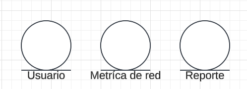

     **Frontera**
     
     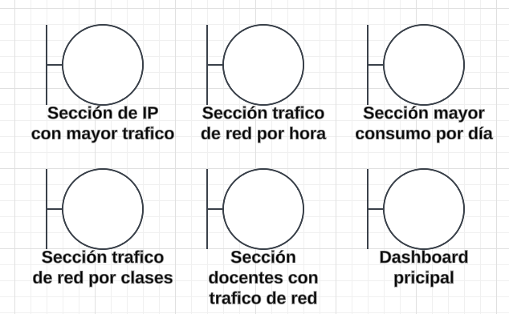

     **Control**
     
     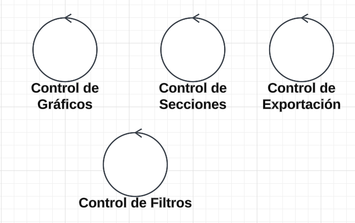
     
   - Diagrama de Actividades con objetos
     
     **Diagrama de actividades: Monitorear estado de red (CU01)**

     

     **Diagrama de actividades: Generar Reportes de Uso (CU02)**
  
     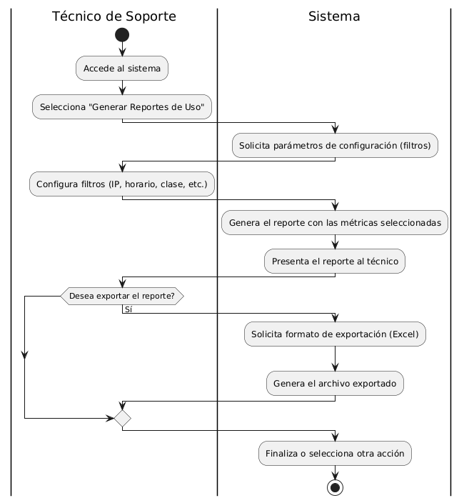

     **Diagrama de actividades: Configurar Dashboard (CU03)**
  
     

     **Diagrama de actividades: Exportar Datos (CU04)**
     
     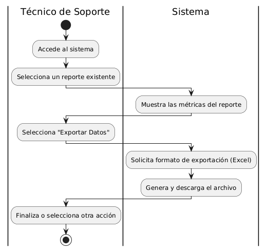
   
   - Diagrama de Secuencia

     **Diagrama de secuencia: Monitorear estado de red (CU01)**
  
     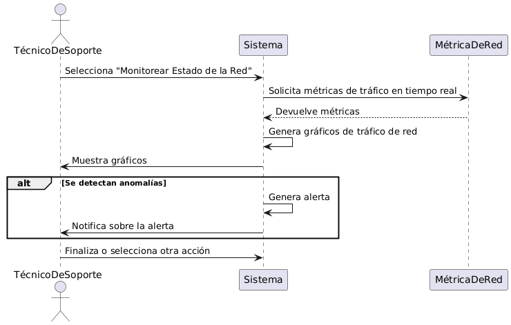
  
     **Diagrama de secuencia: Generar Reportes de Uso (CU02)**
  
     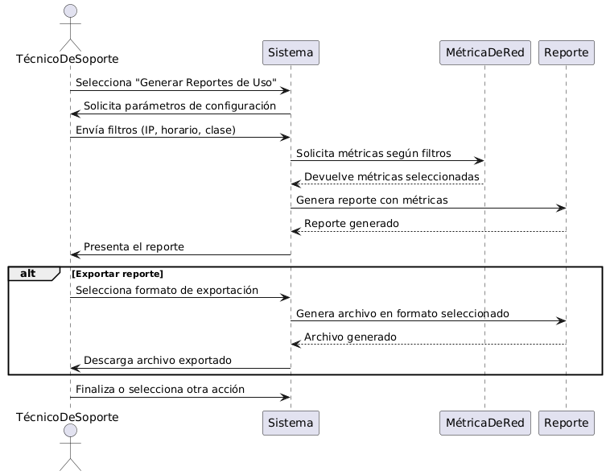
     
     **Diagrama de secuencia: Configurar Dashboard (CU03)**
  
     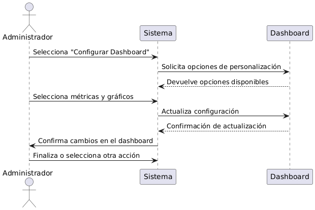
     
     **Diagrama de secuencia: Exportar Datos (CU04)**

     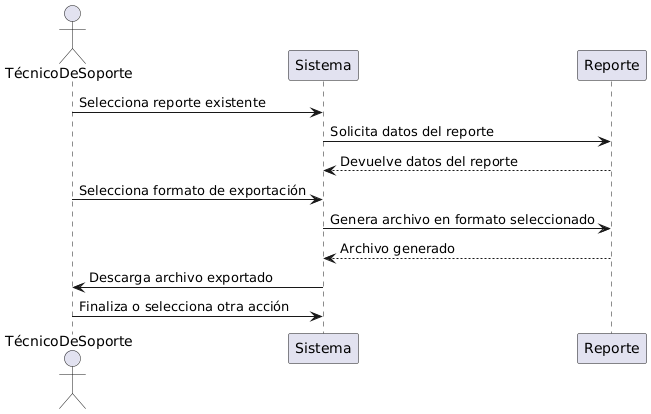
     
   - Diagrama de Clases

     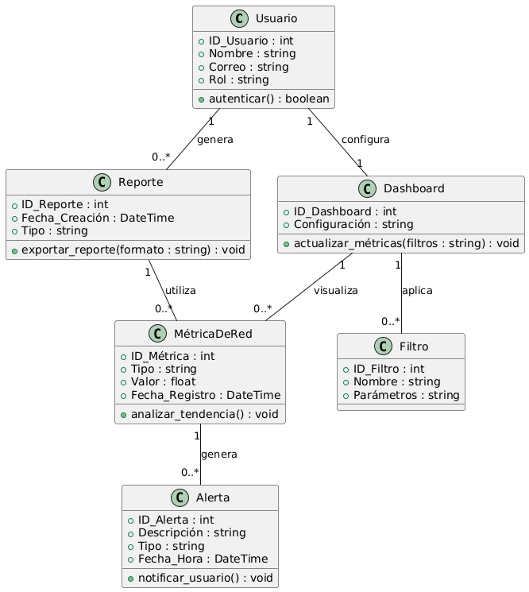

---

# CONCLUSIONES

El análisis realizado demuestra que el proyecto es completamente viable desde las perspectivas técnica, económica, operativa, legal y social. La infraestructura actual de la Universidad Privada de Tacna es suficiente para soportar la implementación del sistema, y los beneficios previstos, tanto económicos como operativos, superan ampliamente los costos asociados. La herramienta de monitoreo propuesta permitirá gestionar de manera eficiente los recursos tecnológicos, optimizando el rendimiento de las redes y computadoras en los laboratorios. Esto se traducirá en una reducción significativa de los tiempos de inactividad y un uso más efectivo de los equipos disponibles.

Además, el sistema tendrá un impacto positivo en la experiencia educativa al proporcionar a estudiantes y docentes una infraestructura confiable y de alto desempeño. Esto no solo mejorará la calidad del aprendizaje y la enseñanza, sino que también fortalecerá la productividad académica en los laboratorios. Al generar información detallada y en tiempo real sobre el rendimiento de los recursos tecnológicos, el sistema permitirá al área de TI y a la administración tomar decisiones proactivas e informadas, impulsando así la eficiencia operativa y la planificación estratégica.

El cumplimiento con las normativas legales, como la Ley N° 29733 de Protección de Datos Personales, garantiza la privacidad y seguridad de la información recolectada, fortaleciendo el impacto ético y positivo del proyecto. Asimismo, el sistema contribuirá a los objetivos de sostenibilidad de la universidad al optimizar el consumo energético y promover el uso responsable de los recursos tecnológicos. Este enfoque no solo optimiza las operaciones actuales, sino que también establece una base sólida para futuras expansiones tecnológicas.

En resumen, este proyecto no solo resuelve las limitaciones actuales en el monitoreo de redes, sino que también abre oportunidades para desarrollos innovadores en otras áreas de la universidad. Su diseño escalable y flexible asegura que pueda adaptarse a las necesidades crecientes de la institución, posicionando a la UPT como un referente en la gestión eficiente y tecnológica de sus laboratorios.

---

# RECOMENDACIONES

Realizar Pruebas Piloto: Implementar el sistema inicialmente en uno o dos laboratorios para identificar problemas potenciales antes del despliegue completo. Esto permitirá optimizar la configuración y abordar cualquier desafío técnico.

Capacitación del Personal: Brindar formación a los equipos de soporte técnico y TI en el uso y mantenimiento del sistema para garantizar una operación eficiente y una transición sin contratiempos.

Monitoreo y Evaluación Inicial: Durante los primeros meses de operación, realizar un monitoreo constante del sistema para ajustar parámetros, optimizar su rendimiento y asegurar su estabilidad.

Plan de Contingencia: Diseñar un plan de contingencia para mitigar riesgos durante la implementación y operación, asegurando la continuidad de las actividades de los laboratorios.

Recoger Feedback de los Usuarios: Incorporar un mecanismo para recopilar comentarios de los usuarios finales (estudiantes, docentes y personal técnico) que permitan evaluar la eficacia del sistema y realizar mejoras continuas.

Escalabilidad del Sistema: Planificar la futura integración del sistema en otros laboratorios y áreas tecnológicas de la universidad, asegurando que pueda crecer junto con las necesidades de la UPT.

---

# BIBLIOGRAFÍA

Fuentes bibliográficas utilizadas en el desarrollo del documento.

---

# WEBGRAFÍA

Listado de referencias web consultadas.

